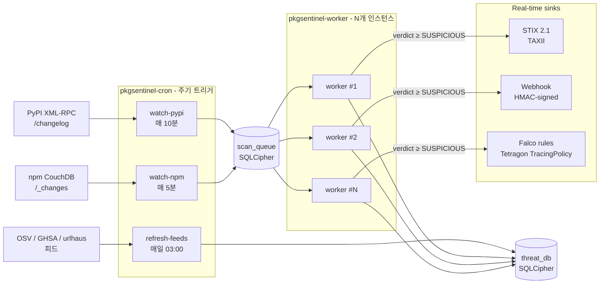

# 패키지 위협 탐지 엔진 V2 — 설계 문서

> 독자적 엔진과 LLM의 이중 검증으로 패키지에서 위협이 될 만한 부분을 전문 탐지한다.

---

## 1. 프로젝트 정체성

### 1.1 목적

임의의 PyPI/npm 패키지를 입력받아 **공신력 있는 공격 프레임워크에 비추어 위협 요소를 전문 탐지**하고, 그 근거를 구조화된 형태로 제시한다.

### 1.2 원칙

1. **모든 패키지를 동일한 강도로 검증한다.**
   - 유명/신규, 인기/비인기 구분 없음.
   - 과거 공급망 공격(event-stream, colors.js, eslint-scope, axios 등)은 모두 인기 패키지에서 발생했다.
   - "smooth하게 넘어가는" 샘플은 없음. 풀 파이프라인으로만 통과.

2. **판정 근거를 데이터로 뒷받침한다.**
   - 모든 verdict는 구조화된 Evidence 리스트로만 설명 가능.
   - "점수 70점" 같은 표현 금지. "T1059 TTP가 매칭되었고 LLM이 ~~ 이유로 판단" 형태.

3. **공신력 있는 지식 베이스에 근거한다.**
   - MITRE ATT&CK, MITRE ATLAS, OWASP LLM Top 10 등 외부 공식 자료를 동적 수집.
   - 자체 규정한 악성 패턴 리스트 같은 것은 판정 근거로 쓰지 않음.

4. **독자적 엔진 + LLM 이중 검증.**
   - 정적 분석이 제시한 근거를 LLM이 재검토.
   - 어느 한쪽만으로 판정하지 않음.

### 1.3 비목표 (안 하는 것)

- 패키지 나이 / 다운로드 수 / 인기도에 따른 판정 할인
- 단순 정규식 키워드 매칭만으로 내리는 판정
- "레지스트리 미등록 = 위험" 같은 표면적 판정
- 특정 공격 유형(예: 슬롭스쿼팅)에 특화된 로직

> 슬롭스쿼팅, 타이포스쿼팅, 악성 주입, 의존성 혼동 등은 **본 엔진의 범용 분석 결과로 자연스럽게 탐지**되는 하위 사례일 뿐.

---

## 2. 두 개의 데이터베이스 (역할 분리)

### 2.1 지식 DB (Knowledge Base) — 판정의 근거

공신력 있는 외부 자료를 **동적으로 수집**하여 판정의 근거로 사용한다.

| 소스 | 내용 | 갱신 방식 |
|---|---|---|
| **MITRE ATT&CK** | Enterprise Matrix Techniques + Sub-techniques | `github.com/mitre/cti` 최신 릴리스 pull |
| **MITRE ATLAS** | AI/LLM 관련 공격 TTP | ATLAS 공식 JSON |
| **OWASP Top 10 for LLM** | LLM 특화 취약점 카테고리 | 공식 PDF 파싱 |
| **OWASP Top 10 (Web)** | 일반 웹 취약점 (참고) | 공식 리포지토리 |
| **CVE/CWE** | 알려진 취약점 분류 | NVD API 또는 주기적 덤프 |
| **GitHub Advisory** | 공급망 공격 공개 사례 | GHSA 피드 구독 |

**자동 갱신 파이프라인이 필수.** 현직자 조언: "DB 수집하고 그 DB는 계속 어떻게 갱신이 될 거고 자동화해서."

> **구현 현황 (2026-05):** 위 표는 목표 설계다. 현재 구현은 두 갈래로 나뉜다.
> - **OSV / popular / IoC 피드** — `pkgsentinel-cron refresh-feeds` (매일 03:00) 로
>   실제 자동 갱신된다.
> - **MITRE ATT&CK / ATLAS / OWASP-LLM TTP 지식 베이스** — 현재는 수동 수집기
>   (`python -m pkgsentinel.knowledge.mitre_attack` → `...embedder`) 로 생성한
>   **정적 스냅샷을 리포지토리에 커밋**해 사용한다 (`knowledge/cache/*.json`).
>   파이프라인은 이 캐시를 로드하며 `kb_versions` 는 `"cached-local"` 로 보고된다.
>   주기적 재수집·재임베딩의 cron 편입은 **로드맵 항목**이며 아직 자동화되지 않았다.
> MITRE ATLAS / OWASP-LLM / CVE·CWE 의 동적 수집도 부분 구현 상태다.

### 2.2 분석 캐시 DB (Analysis Cache) — 성능 최적화

같은 패키지+버전을 반복 분석하지 않기 위한 캐시. **판정 근거가 아님.**

| 테이블 | 키 | 내용 |
|---|---|---|
| `analyses` | `(package, ecosystem, version)` | Evidence 리스트, Verdict, 분석 시각 |
| `archives` | `(package, version)` | 다운로드된 아카이브 해시 |

**검증 강도는 캐시 유무에 영향받지 않음.** 새 패키지/버전은 항상 풀 파이프라인. 캐시 히트 시에만 즉시 반환.

### 2.3 두 DB 역할 비교

```
[지식 DB]                          [분석 캐시 DB]
 MITRE TTP / OWASP / CVE            분석 결과 저장
 ↓                                  ↑
 "위협이 무엇인가"                  "이 패키지를 이미 분석했는가"
 판정의 근거                         성능 최적화
 동적 갱신                           (수동 무효화 가능)
```

---

## 3. Evidence 데이터 모델

판정 근거는 다음 스키마를 따른다. 모든 필드가 채워져야 정식 Evidence로 간주.

```python
@dataclass
class Evidence:
    # 어디서 발견했는가
    file_path: str              # "setup.py"
    line_start: int
    line_end: int
    code_snippet: str           # 실제 코드 원문

    # 무엇이 의심스러운가 (행위 기반)
    behavior_sequence: list[str]      # ["os.environ.get", "base64.b64encode", "requests.post"]
    attack_dimensions: list[str]      # ["INFORMATION_READING", "ENCODING", "DATA_TRANSMISSION"]

    # 공신력 있는 근거 매핑 (지식 DB에서 조회)
    ttp_id: str                 # "T1048.003"
    ttp_name: str               # "Exfiltration Over Unencrypted Non-C2 Protocol"
    ttp_source: str             # "MITRE ATT&CK" | "MITRE ATLAS" | "OWASP-LLM"
    ttp_url: str
    vector_similarity: float    # 0.0~1.0

    # 버전 변화 (해당 시)
    version_diff: Optional[VersionDiffInfo]

    # LLM 재검토
    llm_verdict: str            # "malicious" | "suspicious" | "benign"
    llm_reasoning: str
    llm_model: str

    # 종합 신뢰도
    confidence: float           # 0.0~1.0
```

### Verdict 등급

| Verdict | 조건 |
|---|---|
| `MALICIOUS` | 고심각도 TTP 매칭 ≥ 1 **AND** LLM "malicious" **AND** avg confidence ≥ 0.85 |
| `HIGH_RISK` | (TTP 매칭 ≥ 1 **OR** 버전 차이 위험) **AND** LLM in {"suspicious", "malicious"} |
| `SUSPICIOUS` | TTP 저심각도 매칭 **OR** 버전 차이 있음 **OR** LLM만 "suspicious" |
| `CLEAN` | 모든 Stage 통과, Evidence 비어있음 |
| `ERROR` | Stage 2/4/5 중 실패 (부분 판정 금지) |
| `CANNOT_ANALYZE` | 레지스트리에 등록되지 않은 이름 (분석 자체 불가) |

> `HALLUCINATION` 같은 표현은 없앰. 단순히 "등록되지 않은 이름"으로 기록하며, AI 환각이든 단순 오타든 원인을 판단하지 않음.

---

## 4. 시스템 아키텍처

```
Input: package_name + ecosystem (PyPI | npm) + version (optional)
  ↓
[Stage 0] 레지스트리 확인
  ├─ 존재하지 않음 → verdict: CANNOT_ANALYZE
  └─ 존재함 → Stage 1
  ↓
[Stage 1] 아카이브 다운로드 + Entry Point 추출
  ├─ 캐시 조회 → 있으면 즉시 반환
  └─ 없으면 아카이브 스트리밍
     Entry Point Tier 1 추출:
       PyPI : setup.py, pyproject.toml, __init__.py, __main__.py
       npm  : package.json (scripts/main/bin), postinstall, index.js
  ↓
[Stage 2] Behavior Sequence 추출
  ├─ AST 파싱 (Python ast 모듈 / tree-sitter-javascript)
  ├─ 4 Attack Dimension API 호출 탐지
  │   ├─ Information Reading  : env, fs read, subprocess read
  │   ├─ Encoding/Obfuscation : base64, compile, eval wrappers
  │   ├─ Payload Execution    : exec, eval, spawn, subprocess exec
  │   └─ Data Transmission    : http, socket, fetch
  ├─ 호출 순서 보존 → 시퀀스
  └─ Cerebro 16 features + DONAPI 132 API 카탈로그 활용
  ↓
[Stage 3] 버전 차이 분석 (인기도 무관, 항상 실행)
  ├─ 이전 버전 N-1, N-3, N-5 다운로드
  ├─ Entry Point AST diff
  ├─ 신규 API 호출 식별
  └─ 위험 증가 분류
      ├─ 새 Network + 외부 도메인 상수
      ├─ 새 Execute
      ├─ 새 Encoding+Execute 조합
      └─ 새 파일 조작 (crypto 관련)
  ↓
[Stage 4] TTP 매칭 (지식 DB 벡터 검색)
  ├─ Sentence-Transformer로 시퀀스 임베딩
  ├─ pgvector / Qdrant 에서 지식 DB 검색
  ├─ 코사인 유사도 Top-K
  └─ 매칭된 TTP + confidence
  ↓
[Stage 5] LLM 이중 검증
  ├─ Claude Sonnet API (서버 크레딧 부담)
  ├─ 프롬프트 컨텍스트
  │   - 추출된 Behavior Sequence
  │   - 버전 차이 결과
  │   - 매칭된 TTP (지식 DB의 공식 설명 포함)
  │   - 코드 스니펫
  └─ LLM 판정 + 이유 서술
  ↓
[Stage 6] Verdict 결정
  ├─ Evidence 리스트 집계
  ├─ Verdict 규칙 적용
  └─ 리포트 생성 (JSON + 사람이 읽는 텍스트)
  ↓
[Stage 7] 캐시 저장
  └─ (package, version) → Evidence + Verdict
```

**필수 stage (Behavior / TTP / LLM) 중 하나라도 실패하면 `verdict: ERROR`.** 부분 판정 금지.

### 4.1 구현 매핑 (개념 Stage → 실제 stage 식별자)

위 다이어그램은 개념 모델이다. 실제 `run_pipeline()` 은 이를 실행 순서대로
세분화한 stage 식별자(`stage_00` ~ `stage_20`)로 구현한다 (`StageResult.stage`):

| 식별자 | 내용 | 비고 |
|---|---|---|
| `stage_00_registry` | 레지스트리 존재 확인 | 미등록 → CANNOT_ANALYZE |
| `stage_01_threat_filter` | known_malicious / popular / typosquat 게이트 | exact match → MALICIOUS 단축 |
| `stage_02_attack_history` | OSV 공격 이력 조회 | |
| `stage_03_scorecard` | OpenSSF Scorecard | 참고 메타 |
| `stage_04_slsa` | SLSA 프로비넌스 추정 | 참고 메타 |
| `stage_05_cache_lookup` | 분석 캐시 조회 | hit 시 즉시 반환 |
| `stage_06_full_source` | 전 파일 소스 추출 (Tier 1+2+3) | |
| `stage_07_agentic` | Agentic capability 분류 | agentic 게이트 |
| `stage_08_behavior_sequence` | Behavior Sequence (AST) | **필수** |
| `stage_09_string_analysis` | 문자열 상수 풀 분석 | |
| `stage_10_version_diff` | 전 파일 버전 diff | |
| `stage_11_ttp_matching` | TTP 매칭 (임베딩 + 규칙) | **필수** |
| `stage_12_anomaly_detection` | 카테고리 이상 탐지 | |
| `stage_13_indicator_matcher` | 47-indicator 매처 | |
| `stage_14_sequence_mining` | Sequential pattern mining | |
| `stage_15_taint_slicing` | Taint slicing (source→sink) | |
| `stage_16_llm_review` | LLM 이중 검증 | **필수** |
| `stage_17_dependencies` | 의존성 재귀 (`--deps`) | 옵션 |
| `stage_18_binary` | 바이너리 분석 | 바이너리 존재 시 |
| `stage_19_sandbox` | 샌드박스 동적 분석 (`--sandbox`) | 옵션 |
| `stage_20_ssdf_compliance` | NIST SSDF 준수 체크 | 참고 메타 |

> 캐시 키(`stage_cache.stage`)는 동일 번호 체계를 쓰되 접미사가 짧다
> (예: 리포트 `stage_08_behavior_sequence` ↔ 캐시 `stage_08_behavior`).

---

## 5. 검증 강도 원칙 (핵심)

### 5.1 모든 패키지에 풀 파이프라인 적용

```
인기 여부와 무관하게 동일 파이프라인:
  ├─ axios (5천만 다운로드)   → Stage 1~5 전체 실행
  ├─ requests (3천만)         → Stage 1~5 전체 실행
  ├─ left-pad (2백만)         → Stage 1~5 전체 실행
  └─ my-toy-pkg (100 다운로드) → Stage 1~5 전체 실행
```

### 5.2 검증을 건너뛰지 않는 이유

| 과거 사건 | 교훈 |
|---|---|
| event-stream | 수백만 다운로드 정상 패키지가 특정 버전에서 악성화 |
| colors.js | 저자 본인이 의도적으로 악성 코드 삽입 |
| eslint-scope 3.7.2 | 유명 패키지 계정 탈취 → 악성 버전 배포 |
| ua-parser-js | 유명 패키지 계정 탈취 → 악성 버전 배포 |
| node-ipc | 정치적 이유로 저자가 악성 코드 삽입 |
| axios (공격 시도) | 북한 연계 공격자가 유명 패키지 의존성 혼동 활용 |

**"유명하니까 안전"은 이미 여러 번 반증된 가정이다.** 인기도 기반 필터는 허점이 된다.

### 5.3 버전 차이가 결정적 방어선

유명 패키지의 악성 주입을 잡는 결정적 단서는 **이전 버전과의 행위 차이**. Stage 3이 이 역할을 담당하며, 패키지의 인기도/나이를 완전히 무시한다.

---

## 6. 지식 DB 구축 세부

### 6.1 자동 수집 파이프라인

```python
class KnowledgeBaseUpdater:
    def update_mitre_attack(self):
        """github.com/mitre/cti 최신 릴리스 pull → 파싱 → DB upsert"""

    def update_mitre_atlas(self):
        """ATLAS 공식 YAML → 파싱 → DB upsert"""

    def update_owasp_llm(self):
        """OWASP LLM Top 10 공식 자료 → 파싱 → DB upsert"""

    def update_ghsa(self):
        """GitHub Advisory 공급망 공격 피드 → DB upsert"""

    def rebuild_embeddings(self):
        """Sentence-Transformer로 전체 TTP 재임베딩"""

    def schedule(self):
        """주 1회 자동 실행"""
```

### 6.2 TTPEntry 스키마

```python
@dataclass
class TTPEntry:
    ttp_id: str                 # "T1059.006"
    ttp_name: str               # "Python"
    source: str                 # "MITRE ATT&CK" | "MITRE ATLAS" | "OWASP-LLM"
    version: str                # 프레임워크 버전
    description: str            # 공식 설명
    detection_hints: list[str]  # 공식 탐지 힌트
    mitigations: list[str]      # 완화 방법
    severity: str               # "HIGH" | "MEDIUM" | "LOW"
    url: str                    # 공식 URL
    embedding: list[float]      # 벡터 (검색용)
```

### 6.3 지식 DB 초기 규모 (목표)

- MITRE ATT&CK Enterprise: 200+ Techniques
- MITRE ATLAS: 15+ Techniques (AI 특화)
- OWASP LLM Top 10: 10 카테고리 + 하위
- GHSA 공급망 공격: 최근 50건

**코드 수준에서 정적 탐지 가능한 TTP만 선별.** UI 조작, 물리 접근 같은 항목은 제외.

---

## 7. Stage 세부

### 7.1 Stage 1 — 아카이브 + Entry Point

- PyPI: `pypi.org/pypi/{name}/json` → sdist/wheel URL → 스트리밍 다운로드 → tarfile/zipfile 메모리 파싱
- npm: `registry.npmjs.org/{name}` → `dist.tarball` → tgz 파싱
- 5MB 초과: 다운로드는 하되 분석 파일만 선별

### 7.2 Stage 2 — Behavior Sequence

API 카탈로그 (일부):
```yaml
python:
  information_reading:
    - os.environ.get
    - os.environ.__getitem__
    - subprocess.check_output
    - platform.uname
  encoding:
    - base64.b64decode
    - base64.b64encode
    - compile
    - bytes.fromhex
  payload_execution:
    - exec
    - eval
    - subprocess.run
    - subprocess.Popen
    - __import__
  data_transmission:
    - requests.post
    - requests.get
    - urllib.request.urlopen
    - http.client.HTTPSConnection
    - socket.socket

npm:
  information_reading:
    - process.env
    - fs.readFileSync
    - os.userInfo
    - child_process.execSync
  encoding:
    - Buffer.from
    - atob
    - btoa
  payload_execution:
    - eval
    - Function
    - child_process.exec
    - child_process.spawn
  data_transmission:
    - fetch
    - http.request
    - https.request
    - net.Socket
```

### 7.3 Stage 3 — 버전 차이

- 이전 버전 N-1, N-3, N-5 자동 다운로드
- 같은 방식으로 시퀀스 추출
- diff: 현재 시퀀스 − 이전 시퀀스 = 신규 API 호출
- 신규 호출이 위험 조합(네트워크 + 외부 도메인 하드코딩 등)이면 플래그

**event-stream 사건 재현이 핵심 검증 케이스.**

### 7.4 Stage 4 — TTP 매칭

- 모델: `sentence-transformers/all-MiniLM-L6-v2` (경량, 로컬)
- 입력: 시퀀스를 자연어 설명으로 변환 + 코드 스니펫
- 지식 DB의 각 TTP `embedding`과 코사인 유사도
- 임계값 실험 (초기 0.7 후보, 0.85+ 강 매칭)

### 7.5 Stage 5 — LLM 검증

프롬프트 틀:
```
You are a software supply chain security analyst.

Package: {name} {version} ({ecosystem})

Extracted behavior sequence:
{sequence}

Version diff (new API calls in this version):
{diff_or_none}

Matched TTPs from our knowledge base:
- {ttp_id}: {ttp_name} (similarity: {sim:.2f})
  Official description: {ttp_description}
  ...

Code evidence:
```{lang}
{code_snippet}
```

Question: Based on the above, is this package likely performing
a security-relevant malicious action?

Respond with:
1. Verdict: malicious | suspicious | benign
2. Reasoning: ...
3. Most convincing evidence: ...
```

LLM 응답은 JSON으로 파싱.

### 7.6 Stage 6 — Verdict 결정

```
If all stages passed AND Evidence 비어있음:
    CLEAN
Elif any(ttp.severity == HIGH) AND llm == malicious AND avg_confidence >= 0.85:
    MALICIOUS
Elif (any ttp_match OR version_diff_critical) AND llm in [suspicious, malicious]:
    HIGH_RISK
Elif weak_ttp_match OR version_diff_any OR llm == suspicious:
    SUSPICIOUS
Else:
    CLEAN
```

---

## 8. 클라이언트 인터페이스

### 8.1 주 인터페이스 — CLI

```bash
# 단일 패키지
threat-detect analyze flask --ecosystem pypi

# 특정 버전
threat-detect analyze axios --ecosystem npm --version 1.6.0

# 의존성 파일 일괄
threat-detect scan requirements.txt
threat-detect scan package.json

# 지식 DB 갱신
threat-detect update-kb

# 강제 재분석 (캐시 무시)
threat-detect analyze pkg --force
```

출력: JSON 또는 사람이 읽는 리포트.

### 8.2 확장 프론트엔드 (유지, 확장 여지)

CLI가 안정화되면 같은 엔진을 다음 프론트엔드에서 호출:

- Chrome Extension (AI 사이트 응답 감지)
- VSCode Extension (import 문 실시간)
- FastAPI 서버 (CI/CD 통합)

**엔진 코어는 공통**. 프론트엔드는 사용자 경험용 래퍼.

---

## 8.5 Operational Topology

운영 환경의 프로세스 모델 — `pkgsentinel-worker` / `pkgsentinel-cron` /
`pkgsentinel-feeds` console script 가 어떻게 협업하는지.



### 8.5.1 프로세스별 역할

| 프로세스 | 트리거 | 목적 | 권장 주기 |
|---|---|---|---|
| `pkgsentinel-cron watch-pypi` | systemd timer / cron | PyPI 신규 release 감지 → 큐 적재 | 매 10분 |
| `pkgsentinel-cron watch-npm` | systemd timer / cron | npm 신규 release 감지 → 큐 적재 | 매 5분 |
| `pkgsentinel-cron refresh-feeds` | systemd timer / cron | OSV / popular / urlhaus / feodo 피드 갱신 → DB 적재 + 캐시 무효화 트리거 발화 | 매일 03:00 |
| `pkgsentinel-worker` | systemd service (long-running) 또는 cron `--max N` | 큐 pop → `run_pipeline()` → sink 발송 | 매 5분 (cron 모드) 또는 데몬 |
| `pkgsentinel-feeds` | 수동 / 초기 적재 | 위협 피드 일괄 다운로드 (cron `refresh-feeds` 와 동일 로직 — 별도 entry) | 1회 + 필요 시 |

### 8.5.2 큐 / DB 격리

- **`scan_queue`** (SQLCipher) — watcher 가 적재, worker 가 pop. 동시성은
  SQLite WAL + `lock_next()` 트랜잭션으로 처리. worker N개 안전.
- **`threat_db`** — known_malicious, known_popular, network_blocklist,
  feed_meta, analyses, stage_cache, cache_invalidation_log 모두 한 DB
  (단, 페이지 암호화는 동일).
- **PKGSENTINEL_DB_KEY** 환경변수 (구 `AISLOP_DB_KEY` 도 fallback 으로 인식)
  또는 `~/.pkgsentinel/db.key` 파일로 DB 패스워드 주입.

### 8.5.3 배포 예시

[`examples/systemd/`](../examples/systemd/) 에 systemd unit 파일 2개:

- `pkgsentinel-worker.service` — 큐 consumer, `Restart=on-failure`
- `pkgsentinel-cron.service` + `pkgsentinel-cron.timer` — 주기 트리거

자세한 설치 절차는 해당 디렉터리의 `README.md` 참조.

### 8.5.4 sink 발송 정책

`run_pipeline()` 의 verdict 가 SUSPICIOUS 이상일 때만 sink 발송. CLEAN /
CANNOT_ANALYZE 는 DB 에 저장만. sink 별 포맷:

- **STIX 2.1 TAXII** — Indicator object, `pattern: malicious-activity`
- **Webhook** — JSON 페이로드 + HMAC-SHA256 서명 헤더 (`X-Signature`)
- **Falco** — `falco_rules.yaml` 추가 항목 (커널 레벨 차단)

---

## 9. 구현 로드맵

### Phase 1 — 설계 확정 (3~4일)
- [x] 본 설계 문서
- [ ] Evidence 스키마 파이썬 dataclass 작성
- [ ] Verdict 규칙 의사 코드 확정
- [ ] 지식 DB / 캐시 DB 스키마 SQL 초안

### Phase 2 — 지식 DB 구축 (1~2주)
- [ ] MITRE ATT&CK 자동 수집 스크립트
- [ ] MITRE ATLAS 자동 수집 스크립트
- [ ] OWASP LLM Top 10 파싱
- [ ] Sentence-Transformer 임베딩 파이프라인
- [ ] pgvector 설치 + 인덱스 구축
- [ ] 주기적 갱신 크론
- [ ] 초기 TTP 200+ 검증

### Phase 3 — Ground Truth 수집 (1주)
- [ ] 악성 샘플 50개 (GHSA, PyPI Safety DB, 실제 사건)
- [ ] 정상 샘플 50개 (인기 + 비인기 혼합)
- [ ] 라벨링 + 공격 유형 주석

### Phase 4 — Stage 0/1 (3일)
- [ ] 레지스트리 조회
- [ ] 아카이브 다운로드/추출
- [ ] Entry Point 선별

### Phase 5 — Stage 2: Behavior Sequence (1~1.5주)
- [ ] Python AST 파서
- [ ] JavaScript tree-sitter 파서
- [ ] API 카탈로그 매핑
- [ ] 시퀀스 생성기

### Phase 6 — Stage 3: 버전 차이 (3~4일)
- [ ] 이전 버전 다운로드
- [ ] AST diff
- [ ] event-stream 재현 테스트

### Phase 7 — Stage 4: TTP 매칭 (1주)
- [ ] 임베딩 생성 파이프라인
- [ ] 유사도 검색
- [ ] 임계값 실험

### Phase 8 — Stage 5: LLM 검증 (3~4일)
- [ ] 프롬프트 설계
- [ ] Claude API 통합
- [ ] 응답 파싱 + 검증

### Phase 9 — Stage 6/7: 통합 + 캐시 (3일)
- [ ] Verdict 결정 로직
- [ ] 리포트 생성
- [ ] 분석 캐시 DB

### Phase 10 — CLI (2~3일)
- [ ] 명령어 인터페이스
- [ ] 의존성 파일 스캔
- [ ] 출력 포맷 (JSON + Rich)

### Phase 11 — 벤치마크 (1주)
- [ ] Ground Truth Precision/Recall
- [ ] 실제 사건 재현 (event-stream, colors.js, eslint-scope, ua-parser-js, node-ipc)
- [ ] Claude `/security-review` 비교
- [ ] 보고서 작성

### Phase 12 — 확장 연결 (3~4일, 선택)
- [ ] FastAPI 서버
- [ ] Chrome Extension 재연결
- [ ] VSCode Extension 재연결

**총 예상: 10~12주.** 속도보다 정확도 원칙.

---

## 10. 참고 자료

별도 문서 `references.md`. 학술 논문 (Cerebro, DONAPI 등), 산업 보고서, 공공 프레임워크 (MITRE, OWASP) 전체 목록.

---

## 11. 다음 단계

- [ ] Phase 1 완료: Evidence 스키마, Verdict 규칙 의사 코드, DB 스키마
- [ ] Phase 2 착수: MITRE ATT&CK 자동 수집기 프로토타입
